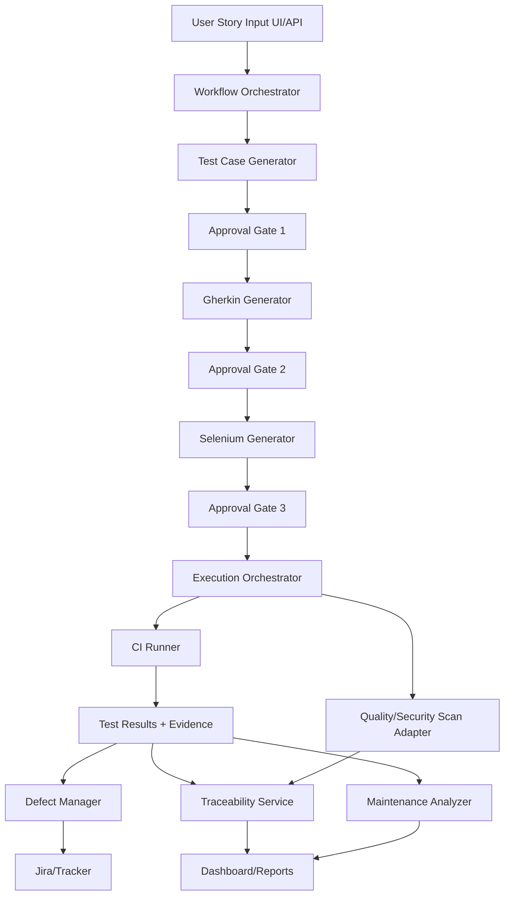
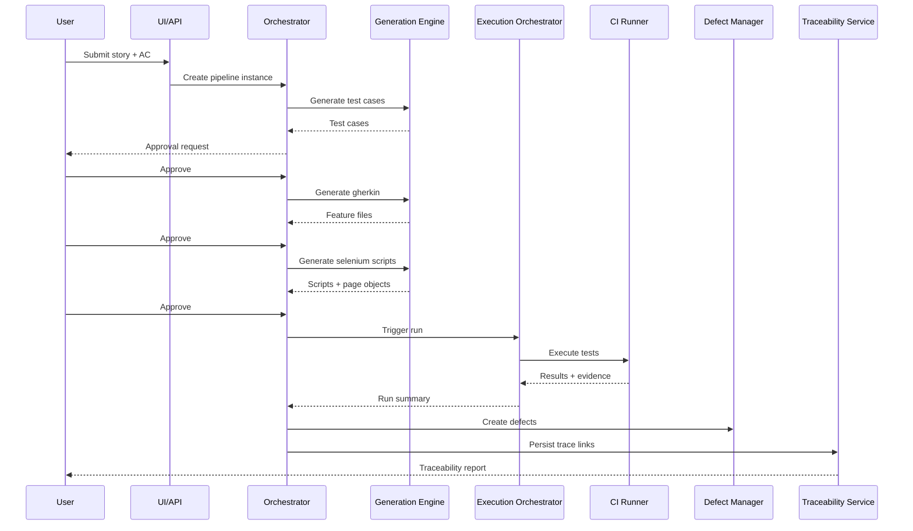

# Architecture Document

## Solution Name
AI Test Lifecycle Platform

## Version
v0.1 (Draft)

## Scope
Defines the target architecture for an end-to-end AI-assisted testing lifecycle platform that transforms user stories into test assets, executes them, manages defects, runs quality/security checks, and supports maintenance.

## Architecture Goals
- Provide deterministic stage-by-stage orchestration with human approval gates.
- Ensure full traceability from story intake to defect creation.
- Support CI/CD and defect tracker integrations with minimal coupling.
- Enable secure, auditable, and scalable operation for enterprise teams.

## Architectural Style
- **Primary style**: Modular monolith for MVP.
- **Evolution path**: Extract orchestration, generation, and execution adapters into separate services as scale grows.
- **Workflow model**: State-machine pipeline with explicit transitions and gates.

## High-Level Component Model
1. **Web UI / API Gateway**
2. **Workflow Orchestrator**
3. **Generation Engine**
4. **Validation & Policy Engine**
5. **Execution Orchestrator**
6. **Defect Manager**
7. **Security & Quality Scan Adapter**
8. **Maintenance Analyzer**
9. **Traceability Service**
10. **Artifact Repository + Metadata Store**
11. **Integration Connectors (Jira, Git, CI)**

## Logical Architecture Diagram

## Core Modules

### 1) Web UI / API Gateway
- Accepts stories, ACs, metadata, and command actions.
- Displays pipeline status, approvals, and outputs.
- Enforces authn/authz and request validation.

### 2) Workflow Orchestrator
- Controls pipeline states:
  - `INGESTED`
  - `TEST_CASES_GENERATED`
  - `TEST_CASES_APPROVED`
  - `GHERKIN_GENERATED`
  - `GHERKIN_APPROVED`
  - `AUTOMATION_GENERATED`
  - `AUTOMATION_APPROVED`
  - `EXECUTED`
  - `DEFECTS_CREATED`
  - `SCANNED`
  - `MAINTENANCE_ANALYZED`
- Blocks forward transitions when gate policies fail.
- Emits audit events for every state transition.

### 3) Generation Engine
- Submodules:
  - Story Parser
  - Test Case Generator
  - Gherkin Generator
  - Selenium Generator
- Uses prompt templates + deterministic post-process validators.
- Generates versioned artifacts with metadata.

### 4) Validation & Policy Engine
- Validates schema, mapping completeness, and quality thresholds.
- Policy examples:
  - AC coverage minimum %
  - max duplicate test rate
  - mandatory reviewer approval for stage transitions

### 5) Execution Orchestrator
- Prepares test packages.
- Triggers CI jobs (GitHub Actions/Jenkins).
- Collects logs, screenshots, pass/fail reports.

### 6) Defect Manager
- Applies defect creation rules from failed tests.
- Deduplicates and enriches tickets.
- Pushes to tracker (MVP: Jira).

### 7) Security & Quality Scan Adapter
- Executes configured scanners (e.g., SonarQube/dependency scan).
- Normalizes findings into a common schema.
- Feeds gate results to orchestrator.

### 8) Maintenance Analyzer
- Detects flakiness and selector drift.
- Recommends stabilization actions and regeneration candidates.

### 9) Traceability Service
- Maintains relation graph:
  Story -> AC -> TestCase -> Feature -> Script -> Run -> Defect/Finding
- Supports exportable traceability reports.

### 10) Storage Layer
- **Artifact Store**: Git repo/object storage for generated files.
- **Metadata DB**: relational DB for entities, statuses, audit records.
- **Evidence Store**: run logs, screenshots, scanner reports.

## Data Contracts (Canonical Schemas)

### StoryModel
- `storyId`, `title`, `description`, `acceptanceCriteria[]`, `priority`, `module`

### TestCaseModel
- `testCaseId`, `storyId`, `acRefs[]`, `type`, `preconditions`, `steps[]`, `expectedResult`, `priority`

### GherkinModel
- `featureId`, `storyId`, `testCaseRefs[]`, `featureText`, `tags[]`

### AutomationModel
- `scriptId`, `featureId`, `framework`, `pageObjects[]`, `stepDefinitions[]`, `testScripts[]`

### ExecutionRunModel
- `runId`, `scriptRefs[]`, `status`, `startTime`, `endTime`, `evidenceRefs[]`

### DefectModel
- `defectId`, `runId`, `failureRef`, `severity`, `title`, `description`, `trackerLink`

### ScanFindingModel
- `findingId`, `category`, `severity`, `component`, `ruleId`, `status`

## Sequence Flow (MVP)

## Security Architecture
- OAuth2/OIDC for user authentication.
- RBAC roles:
  - `QA_ENGINEER`
  - `QA_LEAD`
  - `DEVELOPER`
  - `RELEASE_MANAGER`
  - `ADMIN`
- Secret management via environment vault integration.
- Encryption:
  - TLS for in-transit data.
  - encrypted storage for metadata and evidence.
- Audit logs for:
  - approvals
  - generation requests
  - defect creation actions
  - policy override actions

## Reliability & Scalability
- Queue-backed async jobs for generation and execution triggers.
- Retry policies with idempotency keys for external integrations.
- Backpressure controls for burst story submissions.
- Horizontal scaling path:
  - split generation and execution adapters into independently scaled services.

## Deployment View (MVP)
- Containerized deployment on Kubernetes or managed container platform.
- Services:
  - `api-service`
  - `workflow-service`
  - `generation-service`
  - `integration-service`
  - `maintenance-service`
- Backing services:
  - PostgreSQL
  - Object storage
  - Message queue

## Observability
- Structured logs with correlation IDs (`pipelineId`, `storyId`, `runId`).
- Metrics:
  - generation latency by stage
  - approval wait times
  - execution pass rate
  - defect creation count
  - flakiness index
- Distributed tracing across orchestration, CI adapter, and defect integration.

## Key Architectural Decisions
1. **Modular monolith first** to reduce complexity and accelerate MVP.
2. **State machine orchestration** for deterministic control and auditability.
3. **Human approval gates** to reduce hallucination-driven propagation.
4. **Canonical intermediate schemas** to isolate stage coupling.
5. **Connector adapter layer** to avoid vendor lock-in.

## Risks & Mitigations
- Connector API instability  
  Mitigation: adapter abstraction, resilient retries, versioned clients.
- Test flakiness from dynamic UI  
  Mitigation: robust locator strategy, retry policy, flake scoring.
- AI over-generation/irrelevant cases  
  Mitigation: policy validators, ranking, reviewer checkpoints.
- Evidence storage growth  
  Mitigation: lifecycle retention policy and archival strategy.

## Implementation Phases

### Phase 1 (MVP)
- Story intake + test case + gherkin + selenium generation
- Approval workflow
- CI execution and Jira defect creation
- Basic traceability report

### Phase 2
- Advanced policy/rule tuning
- Expanded scanner adapters
- Maintenance recommendations and flake analytics

### Phase 3
- Multi-framework script generation
- Predictive quality and release risk analytics
- Service decomposition for high-scale teams

## Open Technical Questions
- Which CI should be default connector for initial rollout?
- Which scanner should be mandatory vs optional in gate policy?
- What are tenant isolation requirements for multi-team usage?
- What is the artifact retention policy by environment?

## Recommended Next BMAD Skill
- `bmad-create-epics-and-stories` to convert this architecture and PRD into implementation backlog.
